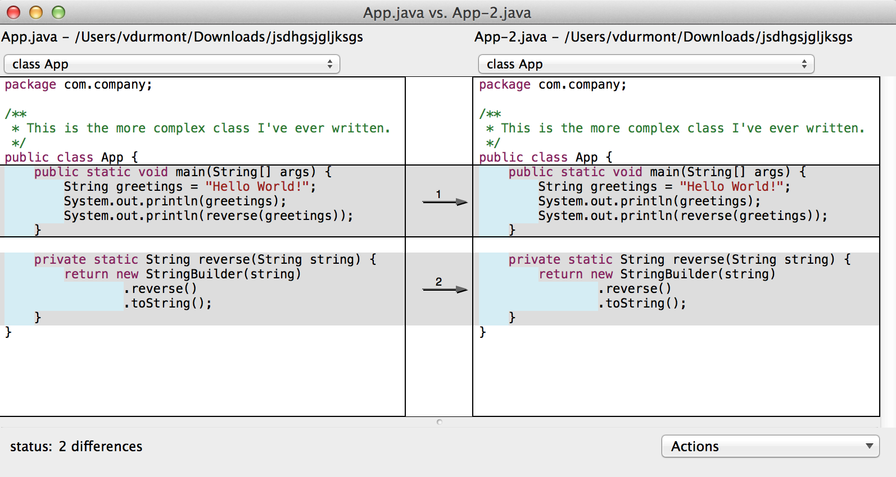

# Codestyle

Codestyle aims at simplifying your life as a Java developer by generating [IntelliJ codestyles](http://www.jetbrains.com/idea/), [Eclipse code formatter](https://www.eclipse.org/) and [maven-checkstyle-plugin](http://maven.apache.org/plugins/maven-checkstyle-plugin/) configurations for your projects.

## Why?

When your join a new project team (in your company or in an open-source project), everyone has a different indentation preference, a different IDE, a different way of formatting code and that makes your commits look like that:

Yes, FileMerge thinks everything changed just because I saved the file with a different indentation setting.

Is it one of the most annoying thing in the world? Yes, definitely.

## How?

There are already some great tools out there. IntelliJ configuration and Eclipse formatter are really useful, maven-checkstyle-plugin is awesome to check that everyone follows the rules but.... **they all use different formats**. So if you want to enforce a specific coding style, you will have to configure everything by hand and that's a huge pain.

To try to merge everything, the solution I suggest is a generator that would be able to:

* Take any of your configuration files in input
* Generate the others files so that you can distribute them in your projects and in your team
* If you're not sure about what you want, a simple form will help you generate everything

Until now, I only talked about IntelliJ, Eclipse and maven-checkstyle-plugin because they are some of the most widely used tools in the Java world but we could easily generate configuration files for .editorconfig, emacs, vim, etc.

## So?

So I want to test this idea. I'm seeking some feedback on several things:

* How do you handle this problem in your developer's life?
* What is your global impression on this idea?
* Would you use a tool like this one?
* What do you think about [this website](http://codestyle.vdurmont.com)?
* Do you have any suggestion? (like another way to solve the problem :D)

**Please send your feedback [IN THIS GOOGLE FORM](http://goo.gl/forms/eFSNNOHocA) or [BY EMAIL](mailto:vdurmont@gmail.com?subject=Feedback%20on%20Codestyle).**
